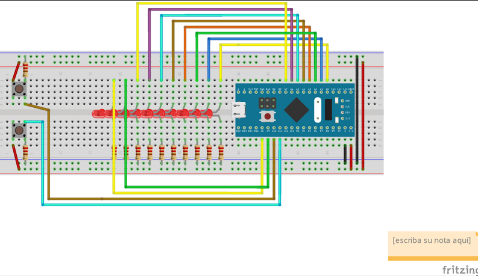

# README

### **Funcionamiento del proyecto**

EL proyecto está conformado por 10 led que muestran el valor binario de una variable, dichos led van prendiendo indicando una valor binario el cual va incrementando a una velocidad de x1 a x4 por medio de un boton y por medio de otro la cuenta decrementa.

### **Paquetes Necesarios:**

Para el funcionamiento de la blue pill se requiere de los siguientes softwares.

- El compilador cruzado que permite generar código máquina para microcontroladores.
- La instalación de los paquetes de Stlink mediante el entorno de MinGW.
- La instalación del STM32CubeProg para realizar la grabación del programa.

### **Alias necesarios**

- Aliar arm-gcc=arm-none-eab-gcc
- Aliar arm-as-arm-none-eabi-as
- Alias arm-objdumo=arm-none-eabi-objdump
- Alias arm-objcopy=arm-none-eabi-objcopy

### **Compilación del software**

En caso de que el código sea una clonación del repositorio de github, se debe desvincular con el comando make unlink

Limpiamos el proyecto de los archivos objetos de un anterior ensamble con el comando make clean.

Para realizar el ensamble se debe escribir el comando make, el cual creara los archivos objetos correspondientes y de igual manera el archivo prog.bin

Corremos el software STM32CubeProgrammer para grabar la blue pill, seleccionando la dirección de memoria 0x080000000 e iniciamos el grabado buscando el archivo prog.bin y descargándolo en la memoria del microcontrolador.

### delay

La funcion del delay es un loop que retrasa el funcionamiento. En dicha funcion utilizamos r0 moviendolo para en el loop compararlo con cero y asi continuar hasta que sean iguales.

### SysTick_initialize

Para realizar el setup del SysTick  inicializando ***SYSTICK_BASE*** y despues desactivamos el SysTick IRQ  para que funcione con nuestro reloj, despues cargamos un valor para que sea el intervalo, dicho valor se guarda en STK_LOAD-OFFSET, pasamos a limpiar el valor colocando un 0 en STK_VAL_OFFSET. Para ponerle la prioridad al SysTick cargamos SC_BASE y por medio de una suma inicializamos SCB_SHPR3_OFFSET. Al utlimo habilitamos el reloj con un #3 al usar la operacion orr entre dicho numero y STL_CTRL_OFFSET.

### SysTick_Handler

Con este archivo restamos 1 a r10 y termina su funcion.

### Main

Al igual que en la practica anterior inicializaremos los puertos de salida para los leds, siendo del puerto A9 - A0 y como entrada los puertos A11 y A10. 

Configuramos EXTI cargando en r0 el AFIO_BASE (Alternative function), luego limpiaremos el r1 para ponerle AFIO_EXTICR3_OFFSET para que se puedan usar correctamente los puertos A11 y A10. Cargamos EXTI_BASE, despues cargamos 0XC00 para cargar los eventos de los puertos.

Configuramos NVIC (Nested vector invict controler), cargamos NVIC_BASE para atender la solicitud del EXTI el cual habilitamos con la instruccion str r1, [r0, NVIC_ISER1_OFFSET]. Al ultimoconfiguramos para que se inicialice el Systick

### check_speed

Con esta funcion realizamos el cambio de velocidad de encendido de los led por medio de los incrementos (delay), cargamos en r8 siendo este (speed) y en un loop realizaremos la compracion don de si speed es 1 regresamos un delay de 1000, si es 2 un delay de 500, si es 3 un delay de 250 y si es 4 de 125 y regresara despues a 1000 siendo 1, al ser diferente de las opciones.

### EXTI15_10_heandler

El EXTI utilizado es el del 15 al 10, más en especifico los 11 y 10. Cargamos EXTI_BASE, cargamos EXTI_PR_OFFSET, cargamos la direccion de EXTI10, si se activa se sumara r8 y se guardara en PR_OFFSET, y se limpia para cuando no se active. y revisara si el EXTI11 se presiono, si es así ira a EXTI11_HANDLER donde negara el registo y realizara una operacion and para que se guarde  PR_PFFSET y en caso de que ninguno este apretado se saldra de las interuppciones EXTI

 veremos si esta prendido si este prende iremops al **`EXTI10_Handler`** en donde vamos a sumar r5 (speed) lo guardamos en el PR_OFFSET y luego lo limpiamos para volverlo a guardar en caso que el EXTI10 no se presione vera si el EXTI11 si se presiono en caso que si entrara a **`EXTI11_Handler`** en donde hara negar el registro y luego hara un and para luego que gurade en PR_PFFSET en caso que tampoco este saltra de la interrupcion EXTI.

### Diagrama de configuración del hardware

